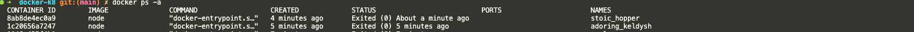
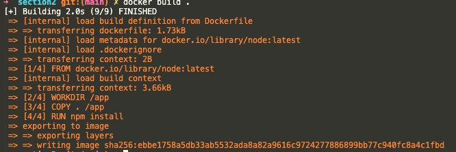
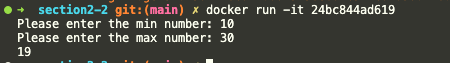
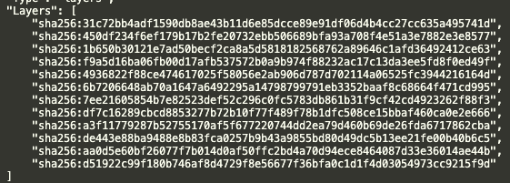

# 이미지

모든 설정 명령과 모든 코드가 포함된 **공유가능한** 패키지.

컨테이너는 그러한 이미지의 구체적인 실행 인스턴스.


## 이미지 사용과 실행

### 외부 이미지의 사용과 실행

- Docker hub 접속
- node js 공식 이미지로 컨테이너 실행
    
    ```python
    docker run node
    ```
    
- 도커 컨테이너를 실행시켰다 하더라도 내부 터미널에 접근할 수 없다.
    
    따라서, 아래의 명령어를 통해 **컨테이너 내부 터미널 세션을 열어 명령어를 입출력**할 수 있다. 
    
    
    ```python
    docekr run -it code
    ```
    
- 다시 dodcker ps -a를 치면
    
    동일한 이미지를 기반으로 하는 컨테이너가 1개 더 생성되어 있는 걸 확인할 수 있다.
    
    
    

### 자체적으로 생성한 이미지의 사용과 실행

- 공식 이미지를 다운로드 한다. ( 예 : Node JS )
- 그 위에 코드를 추가한 새로운 이미지로 코드를 실행한다.

## Docker file을 사용하여 자체적인 이미지 빌드하기

- 실행할 프로젝트의 root 위치에 Dockerfile을 생성한다.
- 해당 파일에 이미지를 빌드할 때 실행하려는 도커에 대한 명령을 작성한다.
    
    ```docker
    FROM node 
    
    WORKDIR /app
    
    COPY . /app
    
    RUN npm install
    
    EXPOSE 80
    
    CMD ["node", "server.js"]
    ```
    
    ---
    
    - **`FROM node`**
        - 도커 허브에 있는 노드 이미지를 가져온다.
    - **`WORKDIR /app`**
        - 도커 컨테이너 내부에서 애플리케이션을 실행하는 작업 디렉토리를 선언한 것이다.
        - 실제로 도커에터 루트폴더를 그대로 사용하기 보단 서브폴더를 사용하는 것을 권장한다.
    - **`COPY . /app`**
        - 첫 번째 경로는 컨테이너의 외부 즉, 이미지로 복사되어야 할 파일들이 있는 곳을 의미한다.
            - 이 프로젝트의 모든 폴더, 하위 폴더 및 파일을 모두 복사해야 한다고 알려주는 것이다.
        - 두 번째 경로는 도커 내부파일 시스템인데, 여기에 파일들이 모두 복사된다.
    - **`RUN npm install`**
        - 이 작업은 디폴트로 도커 컨테이너 및 이미지의 작업 디렉토리에서 실행된다.
    - **`EXPOSE 80`**
        - 언제나 컨테이너가 실행될 때, 로컬 시스템에 특정 포트를 노출하고 싶다는 것을 도커에게 알리는 EXPOSE 명령을 반드시 추가해야한다.
    - **`CMD ["node", "server.js"]`**
        - 이미지를 기반으로 컨테이너를 시작하는 경우에만 서버를 시작하고 싶다면, RUN이 아닌 CMD명령어를 이용한다.
- 작성한 dockerfile을 토대로 새로운 이미지를 생성(빌드)한다.
    
    ```docker
    docker build .
    ```
    
  
    
    dockerfile에 작성한 명령어 그대로 실행되어 이미지가 빌드된 것을 확이할 수 있다.
    
- 해당 이미지 실행해보기 ( 컨테이너 이름 지정해서 )
    
    ```docker
    docker run --name node-project -p 3000:80 {imageID}
    ```
    
    - 중요한 플래그 **`-p {로컬포트}:{도커를 노출할 포트}`**


## ⭐️ 레이어기반 아키텍처 ⭐️

> Dockerfile의 명령어 한 줄 한줄이 레이어다.
> 

변경된 소스코드가 없을 경우, 따로 Copy할 파일이 없기 때문에 캐싱된 레이어로 재빌드를 진행하여 속도가 아주 빠르다. 반면에 변경사항이 있을 경우, 각 명령어 (레이어)들 중에 캐싱된 레어이가 선택적으로 작용하기 때문에 빌드 속도가 저하된다. ( **한 레이어가 변경될 때마다 후속 레이어들도 재실행이 된다.** )

그렇기 때문에, 현재 Dockerfile에서는 소스코드를 변경하고 재빌드할 때마다 pacakge.json에 있는 모든 패키지들이 다시 처음부터 install이 된다.

이런 불필요한 과정을 막기 위해 Dockerfile을 아래와 같이 변경하면, 빌드속도를 최적화할 수 있다!

**before**

```docker
FROM node 

WORKDIR /app

COPY . /app

RUN npm install

EXPOSE 80

CMD ["node", "server.js"]
```

**after**

```docker
FROM node 

WORKDIR /app

COPY package.json /app

COPY . /app

RUN npm install

EXPOSE 80

CMD ["node", "server.js"]
```

# 이미지 & 컨테이너 관리

## 여러가지 mode 명령어

### docker run vs docker start

|  | docker run  | docker start |
| --- | --- | --- |
| 컨테이너 생성 | 새 컨테이너를 생성하고 실행 | 기존 컨테이너를 다시 시작 |
| 이미지 필요여부 | 실행할 이미지를 반드시 명시해야 함 | 이미 생성된 컨테이너가 있어야 함 |
| 상태  | 새로 실행되는 컨테이너느 초기상태로 시작 | 이전 컨테이너의 상태를 유지하고 시작 |
| 디폴트 모드 | attached mode | detached mode |

### detached mode vs attached mode

- attached mode  ( 터미널과 컨테이너의 출력을 연결하지만, 실시간 입력은 기본적으로 지원하지 ❌ )
    - 컨테이너를 포그라운드에서 실행하고, 터미널을 컨테이너와 연결한다.
        
        ```docker
        docker run -it -name {컨테이너 이름} {이미지 ID}
        
        # detached mode에서 attach mode로 전환
        docker start 
        docker attach {컨테이너 이름}
        ```
        
    - 사용자의 터미널과 컨테이너의 **출력 (stdout) / 에러 (stderr)**를 연결한다.
- detached mode
    - 컨테이너가 배그라운드에서 실행된다.
        
        그렇기 때문에 별도로 `docker logs` 같은 명령어가 필요하다.
        
    - 명령어 플래그로는 -d로 detached mode로 실행할 수 있다.
        
        ```docker
        docker run -p {로컬포트}:{도커포트} -d {컨테이너 ID} 
        ```
        
    - **웹서버처럼 계속 실행되어야 하는 서비스는 detached mode로 해야함.**

### interactive mode vs terminal mode

- interactive mode (실시간 입력 및 출력이 가능한 대화형 환경)
    - 사용자가 제공한 입력에 따라 즉각적으로 작업을 수행하고 결과를 반환하는 모드
        
        ```docker
        # 처음부터 표준출력,입력 모두 활성화 시키는 방법
        docker run -it 24bc844ad619
        
        # 어태치모드에서 표준입력까지 활성화 시키는 방법
        docker start -a -i 6a106e80d7c2
        ```
        
        
        
    - **표준 입력(stdin), 표준 출력(stdout), 표준 에러(stderr)**가 연결된다.
- terminal mode
    - 명령을 실행하고 끝내는 모드
        
        ```docker
        docker run 24bc844ad619 echo "Hello, World"
        docker 
        ```
        

---

## 필요없는 모듈 삭제 명령어

- 이미지 삭제
    
    ```docker
    docker rmi {이미지 ID}
    ```
    
- 사용되지 않는 모드 이미지 삭제
    
    ```docker
    docker image prune
    ```
    
- 실행중인 컨테이너 삭제
    
    ```docker
    docker stop {컨테이너 ID}
    docker rm {컨테이너 ID}
    ```
    
- 다중 삭제
    
    ```docker
    docker rm {컨테이너 ID} {컨테이너 ID} {컨테이너 ID}
    ```
    

### 컨테이너 생성할 때부터 중지될 때 자동 삭제시키는 실행명령어

- `—rm 플래그`
    
    ```docker
    docker run -p 3000:80 --name node-container -d --rm 56ac5603c4d7
    ```
    
    - docker stop {컨테이너ID}
    - docker ps -a 하면, 해당 컨테이너 중지 즉시 삭제된 것을 확인할 수 있다.

### 이미지 정보

- 이미지 정보
    
    ```docker
    docker image inspect {이미지 ID}
    ```
    
    - 빌드한 이미지의 레이어를 확인해보니…**명령어의 개수보다 레이어가 많다..?**
        
        
        
        - 일단 베이스 이미지 자체가 여러 레이어로 구성되어 있다.
        - Docker 내부에서의 최적화
            - 복잡한 명령어가 있을 땐, 일부 작업들이 알아서 별도 레이어로 나누어지기도 한다.
        - LABEL, ENV 같은 메타데이터 레이어가 생성되는 경우도 있다.
        - 캐싱과 재사용을 위해 중간데이터를 저장하기도 한다.

- 이미지 이름과 태그 지정
    - 보다 더 특정화된 이미지를 빌드할 수 있다.
    
    ```docker
    # 이름 : 특정화된 이미지
    docker build -t {이미지 이름}.
    # 태그 : 특정화된 이미지에 버전을 기입할 수 있다.
    docker build -t {이미지 이름}:{이미지 버전}
    ```
    

### 컨테이너

- 컨테이너 이름과 태그 지정
    
    ```docker
    docker run --name {컨테이너 이름} {이미지 ID}
    ```
    

- COPY
    - 일반적으로 이런식의 작업은 하지 않지만, 이미지를 빌드하지 않고 컨테이너에 소스코드를 업데이트 할 수 있다. → 그렇지만 risky한 방법
    
    ```docker
    # 로컬에 있는 폴더 특정 컨테이너로 COPY
    docker cp dummy/. node-container:/test
    
    # 컨테이너에 있는 파일 로컬에 COPY
    docker cp node-container:/test dummy
    docker cp node-container:/test/text.txt dummy
    ```
    

## 이미지 공유하기

- Docker Hub에 이미지를 공유할 수 있다.
- 공개는 무료이지만, 프라이빗일 경우에 1개만 공유할 수 있다.

## 이미지 가져오기

```docker
docker pull {이미지 이름}:{태그}
```