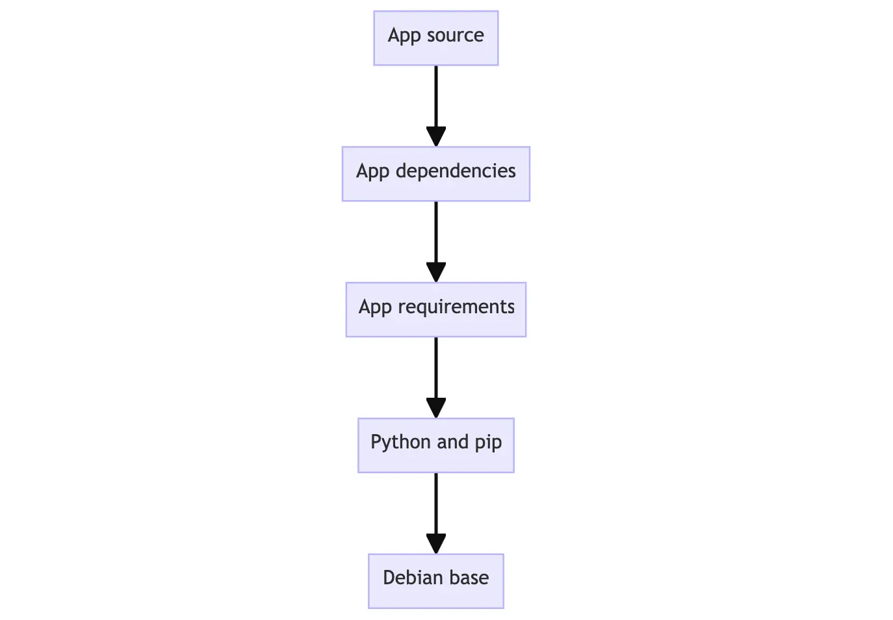

# 섹션02 - Docker 이미지 & 컨테이너: 코어 빌딩 블록

## 이미지와 컨테이너

- 이미지는 템플릿이다.
- 이미지는 코드와 코드를 실행하는데 필요한 도구를 포함한다.
- 컨테이너는 이미지의 실행 인스턴스

## 외부 이미지의 사용 & 실행

```bash
# 노드 이미지 다운로드
docker pull node:latest

# 노드 이미지 실행
docker run node

# 실행중인 컨테이너 확인하기
docker ps -a

# 컨테이너 interactive 모드로 실행하기
docker run -it node
```

## 이미지 레이어 이해하기

1. 컨테이너 실행 동작
    - 컨테이너 실행 시 Dockerfile의 명령을 기반으로 이미지를 실행함.
    - Dockerfile에 지정된 마지막 명령이 실행되어 애플리케이션이 시작됨.

2. 레이어 구조
    - Docker 이미지는 여러 레이어로 구성됨.
    - Dockerfile의 각 명령은 별도의 레이어를 생성함.
    - 최종 레이어는 컨테이너 실행 시 활성화됨.

3. 이미지 캐싱 원리
    - Docker는 레이어별로 변경 여부를 확인함.
    - 변경되지 않은 레이어는 캐시에서 재사용됨.
    - 변경된 레이어 이후의 모든 레이어는 다시 생성됨.

4. 최적화 팁
    - 자주 변경되는 파일은 Dockerfile의 하단에 배치해 빌드 속도를 최적화할 수 있음.
    - 종속성 설치와 같은 변경이 적은 명령은 상단에 배치해 캐시 재사용을 극대화할 수 있음.

## 이미지와 컨테이너 동작 방법 이해하기

- 컨테이너는 이미지에서 코드와 환경을 새 컨테이너로 복사하거나 새 파일로 복사하지 않는다.
- 컨테이너는 이미지에 저장된 환경을 사용한다. 이미지 위에 추가된 얇은 레이어일 뿐이다.

## 기본적인 도커 명령

```bash
docker ps -a  # 모든 컨테이너를 표시(중지되었거나, 실행 중인 컨테이너)

docker run # 이미지를 기반으로 새 컨테이너를 만들고 그 이후에 새 컨테이너가 시작
```

### attached mode vs detached mode

- attached mode: 컨테이너가 실행되면서 터미널을 차지하고 있음.
    - 우리가 그 컨테이너의 출력 결과를 수신한다는 것을 의미한다.
- detached mode: 컨테이너가 실행되면서 터미널을 차지하지 않음
    - background에서 실행되는 것과 같은 효과
- `docker start` 는 detached mode가 기본값
- `docker run` 은 attached mode가 기본값
- detached mode로 실행했을 때 `docker attach` 를 통해 다시 연결할 수 있음
- 혹은 docker logs 를 통해 컨테이너의 출력된 로그를 확인할 수 있음(`-f` 옵션으로 계속 수신대기 할 수 있음)

### 인터렉티브 모드 & 터미널 모드

- `-i` : 인터렉티브 모드
- `-t` : 터미널 모드

```bash
docker build -f Dockerfile-rng -t section02-rng .

docker run -it section02-rng

# 또는 중지 시킨 뒤 아래의 명령을 실행해도 된다.
docker start -ai {컨테이너 이름}
```

### 필요없는 컨테이너 & 이미지 삭제하기

```bash
# 중지된 컨테이너 삭제
docker rm $(docker ps -aq -f "status=exited")

# 필요없는 이미지 삭제(실행하고 있는 컨테이너가 사용하는 이미지는 삭제 안됨)
docker image prune
```

- 강의에서 알려준 `--rm` 옵션은 개인적으로 개발환경에서만 써야 한다. 프로덕션 환경에서는 지양하는 것이 좋다.
    - 컨테이너 로그 분석이 필요한 경우 즉시 삭제되면 문제 해결이 어려움
    - 장애 발생 시 원인 파악을 위한 컨테이너 상태 확인이 불가능
    - 자동화된 모니터링 도구가 컨테이너 상태를 추적하기 어려움

## 이미지 검사하기

- docker inspect {이미지 ID}
- 환경변수, 포트, CMD 명령 등을 확인할 수 있다.
- 또한 레이어의 정보나 네트워크 정보 등도 확인 할 수 있다.ㅉ

## 복사하기

- `docker cp {소스경로} {복사 타겟 경로}`
- `docker cp {호스트 경로} {컨테이너 이름}:{타겟 컨테이너 경로}` 호스트 머신의 파일을 컨테이너로 복사
- `docker cp {컨테이너 이름}:{컨테이너 경로} {호스트 경로}` 컨테이너의 파일을 호스트 머신으로 복사

## 이름 지정하기

- `--name` 옵션을 사용하여 컨테이너 이름을 지정할 수 있다.
- 이미지 태그도 지정할 수 있음 `-t {이미지 이름}:{태그}`

```bash
docker build -t goals:latest .
```

## 이미지 공유하기

- Docker Hub에 이미지를 공유할 수 있다.
- 공개 저장소면 무료이고, 프라이빗 저장소는 1개만 가능하다

## 이미지 가져오기

- `docker pull {이미지 이름}:{태그}`

## 이미지 레이어에 대한 심화

### 이미지 레이어 순서

- python 앱이라고 가정한다면 이론적인 이미지는 다음과 같다.

1. 첫 번째 계층은 기본 명령과 apt와 같은 패키지 관리를 추가한다.
2. 두 번째 계층은 두 번째 계층은 종속성 관리를 위해 Python 런타임과 pip를 설치한다.
3. 세 번째 계층은 응용 프로그램의 특정 requirements.txt 파일을 복사한다.
4. 네 번째 계층은 해당 애플리케이션의 특정 종속성을 설치한다.
5. 다섯 번째 계층은 응용 프로그램의 실제 소스 코드를 복사한다.



```bash
# 기본 이미지 설정
FROM ubuntu:20.04

# Maintainer 정보
LABEL maintainer="your_email@example.com"

# 환경 변수 설정 (예: 비대화식 apt 설치)
ENV DEBIAN_FRONTEND=noninteractive

# 1. 기본 패키지 설치
RUN apt-get update && apt-get install -y \
    build-essential \
    curl \
    wget \
    vim \
    python3 \
    python3-pip \
    python3-venv \
    && rm -rf /var/lib/apt/lists/*

# 2. pip 최신화
RUN pip3 install --upgrade pip

# 3. 작업 디렉토리 설정
WORKDIR /app

# 4. requirements.txt 복사
COPY requirements.txt .

# 5. 종속성 설치
RUN pip install --no-cache-dir -r requirements.txt

# 6. 소스 코드 복사
COPY . .

# 7. 컨테이너 실행 시 기본 명령 설정
CMD ["python3", "app.py"]
```

### 레이어 쌓기

출처: [잡다한 기술공방](https://creboring.net/blog/how-docker-divide-image-layer/), [이미지 레이어 이해하기](https://docs.docker.com/get-started/docker-concepts/building-images/understanding-image-layers/)

- 계층화는 콘텐츠 주소 지정이 가능한 저장소와 유니온 파일 시스템에 의해 가능하다.

1. 각 계층이 다운로드되면 호스트 파일 시스템의 자체 디렉토리로 추출한다.
2. 이미지에서 컨테이너를 실행하면 레이어가 서로 위에 쌓여 새롭고 통합된 뷰를 만드는 유니온 파일 시스템이 생성된다.
3. 컨테이너가 시작되면 chroot를 사용하여 컨테이너의 루트 디렉터리가 이 통합 디렉터리의 위치로 설정된다.

- 유니온 파일 시스템이 생성되면 이미지 레이어 외에도 실행 중인 **컨테이너를 위한 디렉터리가 특별히 생성된다**. 이렇게 하면 컨테이너가 파일 시스템을 변경하면서 원본 이미지 레이어는 그대로 유지할 수 있다.
  이렇게 하면 동일한 기본 이미지에서 여러 컨테이너를 실행할 수 있다.
- 이미지 레이어는 ‘파일시스템의 변경사항을 캡처하는 단위’ 이다.
- > 도커의 레이어 방식은 이미지뿐만 아니라 컨테이너가 실행될 때도 사용됩니다. 이미지를 이용해 새로운 컨테이너를 실행하면, 이미지 레이어 스냅샷들이 복원되고 신규 컨테이너 공간에 mount 됩니다. 그리고 그
  이후 해당 mount 위에 새로운 레이어가 구성되는데, 해당 컨테이너 환경 내에서 발생하는 모든 변경사항이 이 새로운 레이어에 저장됩니다. 이를 컨테이너 레이어라 부릅니다.   
  > 이는 해당 컨테이너에서의 변경사항이 기존 이미지 레이어에 영향을 가하지 않고 해당 컨테이너의 격리된 공간 내에서만 행해짐을 뜻합니다.   
  > 기존 이미지 레이어들이 Read Only로 읽기만 가능한 것과 반대로, 새로 만들어진 컨테이너 레이어는 Read와 Write가 모두 가능합니다. 대신, 별도의 namespace 공간에서 새로운 레이어를 띄워
  작업하기 때문에, 해당 컨테이너가 종료되면 변경사항 또한 모두 함께 삭제됩니다.

## UnionFS 란? (w/ Chatgpt)

**UnionFS (Union File System)**는 Docker에서 여러 파일 시스템을 결합하여 하나의 가상 파일 시스템을 만들기 위해 사용되는 기술입니다. Docker는 **UnionFS**를 사용하여 여러
레이어를 하나로 합쳐 **이미지**와 **컨테이너**의 파일 시스템을 구성합니다. 이를 통해 **파일 시스템의 레이어들**을 **효율적으로 합성**하여, **디스크 공간을 절약**하고 **빠른 속도**로 파일을
처리할 수 있습니다.

### UnionFS의 핵심 개념

UnionFS는 여러 디스크 공간을 **하나의 가상 파일 시스템**으로 병합하여 여러 레이어를 지원하는 파일 시스템입니다. 이 시스템은 각 파일 시스템이 **읽기 전용**이고, 필요 시 **읽기/쓰기** 가능한
레이어가 추가됩니다.

### Docker에서 UnionFS의 사용

Docker는 컨테이너와 이미지를 관리하기 위해 UnionFS의 다양한 구현체를 사용합니다. Docker의 **파일 시스템 드라이버**는 UnionFS를 기반으로 하여 여러 레이어를 관리합니다.

#### Docker에서 사용하는 UnionFS 구현체

1. **OverlayFS**:
    - OverlayFS는 Docker에서 가장 널리 사용되는 UnionFS 구현입니다.
    - 이 파일 시스템은 **`lowerDir`** (읽기 전용 레이어)와 **`upperDir`** (읽기/쓰기 가능한 레이어)로 구분됩니다.
    - OverlayFS는 **Copy-on-Write** 방식으로 작동하여, 기존 파일을 수정하려는 경우, 파일을 새로운 `upperDir`로 복사하여 변경된 내용을 기록합니다. 이를 통해 디스크 공간을
      절약하고 효율적인 파일 관리를 할 수 있습니다.

2. **AUFS (Another Union File System)**:
    - Docker는 이전에 AUFS를 사용했으나, 최근에는 OverlayFS로 대체되고 있습니다.
    - AUFS는 여러 개의 디렉터리 레벨을 결합하여 하나의 파일 시스템으로 만들 수 있으며, 파일 시스템의 레이어가 많아지면 관리가 어려워질 수 있습니다.

3. **Btrfs와 ZFS**:
    - Btrfs와 ZFS도 UnionFS와 비슷한 방식으로 파일 시스템의 여러 레이어를 관리할 수 있습니다. 하지만 Docker에서 기본적으로 사용되는 파일 시스템은 아니며, 특정 요구 사항이 있을 때 사용될
      수 있습니다.

### UnionFS의 장점

- **디스크 공간 절약**: 여러 컨테이너가 동일한 이미지 레이어를 공유하여, 여러 컨테이너가 있을 때도 저장 공간을 절약할 수 있습니다.
- **빠른 성능**: 새로운 레이어가 기존 레이어 위에 추가되기 때문에, 컨테이너 실행 시 필요한 파일을 빠르게 조회할 수 있습니다.
- **Copy-on-Write (COW)**: 파일을 변경할 때마다 해당 파일이 변경된 새로운 레이어에 저장되며, 원본 파일은 읽기 전용으로 유지됩니다. 이를 통해 불필요한 중복을 방지하고, 변경된 내용만
  저장됩니다.

### UnionFS의 동작 원리

- **이미지 레이어**는 읽기 전용이며, 여러 컨테이너에서 공유됩니다.
- **컨테이너의 변경 사항**은 읽기/쓰기 레이어에 저장되며, 변경되지 않은 파일은 여전히 기존의 이미지 레이어에서 참조됩니다.
- **컨테이너가 삭제되면** 해당 컨테이너의 읽기/쓰기 레이어만 제거되고, 이미지 레이어는 그대로 유지됩니다.

### 예시: Docker에서 UnionFS를 사용하는 방식

1. **이미지 빌드**:
    - Docker 이미지는 여러 레이어로 구성됩니다. 각 레이어는 `Dockerfile`의 명령어 하나로 만들어집니다.
2. **컨테이너 실행**:
    - 컨테이너가 실행되면 이미지의 읽기 전용 레이어 위에 새로운 읽기/쓰기 레이어가 추가됩니다.
    - 이 읽기/쓰기 레이어는 컨테이너가 실행되는 동안만 존재하며, 컨테이너 종료 후 삭제됩니다.

---

UnionFS는 Docker에서 파일 시스템을 관리하고, 여러 레이어를 효율적으로 결합하여 컨테이너 기반의 가상화 시스템을 실용적으로 만들어주는 중요한 기술입니다. 이를 통해 Docker는 이미지를 빠르게 빌드하고,
컨테이너를 경량화하며, 리소스를 효율적으로 관리할 수 있습니다.

```